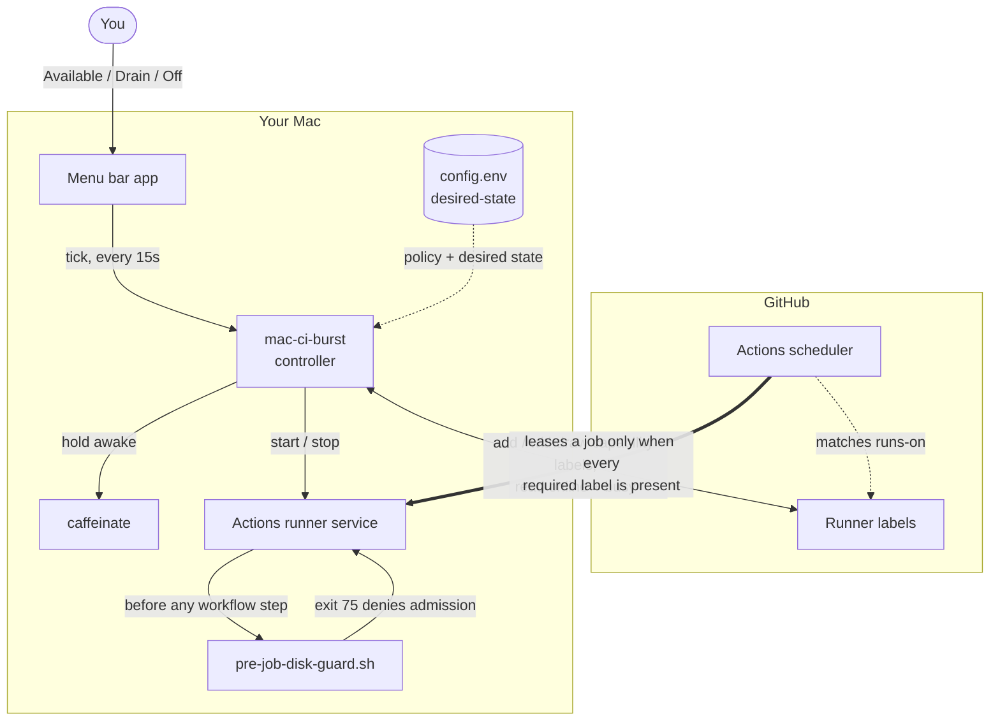

# Mac CI Burst Runner

An opt-in menu-bar controller for using a Mac as a GitHub Actions self-hosted
runner only when you choose. It works with Apple Silicon and Intel Macs, and with
organization-scoped or repository-scoped runners.

The controller has four operator states:

- **Off:** the runner service is stopped and the Mac's capability labels are absent.
- **Available:** the capability labels are present, the service is online, and the
  Mac is held awake while connected to power.
- **Busy:** GitHub reports an active job. Turning Off is refused.
- **Draining:** eligibility is removed immediately; the current job may finish,
  then the service and sleep assertion stop.

It also enforces a configurable free-disk floor before availability and again in
a GitHub Actions job-start hook.

## How it works

The controller never touches the job queue. It owns three switches on the Mac —
the runner's capability labels on GitHub, the runner service, and a sleep
assertion — and GitHub's own label matching does the scheduling.



Going Available adds every capability label while the runner is still offline,
then starts the service, so the machine becomes eligible at that moment and not
before. Drain removes the labels first and only then waits, so an in-flight job
finishes while nothing new can be leased. Off refuses outright while GitHub
reports the runner busy.

The menu app polls `mac-ci-burst tick` every 15 seconds. That reconciles the real
state toward the desired one: re-applying the label set after a configuration
change, clearing labels nothing manages, and dropping out of Available if free
disk falls under the floor.

A leased job then passes the job-started hook before any workflow step runs. That
is the second gate, and an independent one — it reclaims space where it can and
denies admission with exit 75 if the floor is still breached.

This is defense in depth against *your own* scheduling, not a sandbox. Once a job
is leased it runs with the permissions of the macOS account, as the
[Safety model](#safety-model) explains.

## Capability labels

You declare what a Mac *is* — architecture, chip, model, OS, memory — as
`BURST_LABELS`. Ask the machine rather than typing it from memory:

```bash
mac-ci-burst capabilities
# ARM64,M2,macbook_air,macos-26,ram-8gb
```

That reports architecture (`ARM64`/`X64`), Apple silicon generation (`M2`,
`M4-Pro`, …), model (`macbook_air`, `macbook_pro`, `mini`, `studio`, …), major OS
(`macos-26`), and memory (`ram-8gb`). It only prints a suggestion; you decide
what the machine should actually advertise:

```sh
BURST_LABELS=M2,macbook_air,macos-26,ram-8gb
RUNNER_LABELS=self-hosted,macOS,ARM64
```

Structured labels let a workflow say what it needs rather than which box it wants
— `macos-26` for an OS bump, `M2` for a chipset check, `ram-8gb` to keep a
memory-hungry build off a small machine.

That set is also the scheduling switch. Going Available adds every entry; Drain
and Off remove every entry. Workflows select on capability, not on machine
identity, so a job lands on whichever opt-in Mac is currently Available and meets
its requirements:

```yaml
jobs:
  build:
    runs-on: [self-hosted, macOS, ARM64, M2, macos-26]
```

GitHub does not negotiate capabilities dynamically — label matching *is* the
mechanism. What makes this safe is that the labels a job selects on are exactly
the labels the controller withdraws when you stop lending the machine.

The corollary is the one rule you must check yourself: whatever `RUNNER_LABELS`
still holds once `BURST_LABELS` is stripped (normally just `self-hosted` and
`macOS`) is what the Mac keeps matching while Off. No workflow may be satisfiable
by that remainder alone. `setup-runner.sh` prints both sets at registration so
you can confirm it.

Drain and Off do not remove only the configured capabilities — they reduce the
runner to exactly that static remainder. Renaming a capability, or adding a label
by hand in the GitHub UI, would otherwise leave a label nothing manages, and an
unmanaged label keeps the Mac matchable no matter how often you drain. Anything
advertised that is in neither set is reported as `unmanagedLabels` in
`mac-ci-burst status` and flagged in the menu until the next Drain or Off clears
it. If a label cannot be deleted, the controller says so on stderr rather than
reporting a clean drain.

## Tiered disk guard

The job-start hook is a tiered guard rather than a single threshold check. It
re-measures free space between tiers and stops as soon as the space is back:

- **Tier 0 (always):** remove per-run artifact directories under `ARTIFACT_DIR`,
  keeping the newest `ARTIFACT_KEEP` and the directory for the current
  `GITHUB_RUN_ID`.
- **Tier 1 (free below `SOFT_FREE_GIB`):** run `SWEEP_CMD` over each entry in
  `CACHE_DIRS` to drop build artifacts older than `SWEEP_DAYS`. With no template
  configured this uses `cargo-sweep` when it is available, and is skipped
  otherwise.
- **Tier 2 (free below `MIN_FREE_GIB`, admission only):** run `CLEAN_CMD` over
  the same directories. The default is `cargo clean`; deleting a tree outright
  requires an explicit `CLEAN_RM=1`.

Admission is denied with exit 75 only if free space is still under the floor
after tier 2. The controller also runs tiers 0 and 1 as an idle housekeeping
pass (`mac-ci-burst reconcile`) while the runner is Available, idle, and between
the floor and the soft threshold, at most once per `SWEEP_INTERVAL_SECONDS`.
Nothing is swept while a job is running, and sweeping never removes eligibility.
`CACHE_DIRS` is empty by default, which leaves the guard behaving as a plain
free-space floor.

### Disk guard configuration

| Key | Default | Meaning |
| --- | --- | --- |
| `MIN_FREE_GIB` | `100` | Hard floor; admission is denied below it. |
| `SOFT_FREE_GIB` | `2 * MIN_FREE_GIB` | Reclamation threshold; never denies. |
| `DISK_VOLUME` | `/System/Volumes/Data` | Volume measured. |
| `SWEEP_INTERVAL_SECONDS` | `3600` | Minimum gap between idle sweeps. |
| `CACHE_DIRS` | empty | Colon-separated directories or globs, in order; relative to the runner `_work`. |
| `ARTIFACT_DIR` | empty | Per-run artifact parent; empty disables tier 0. |
| `ARTIFACT_KEEP` | `3` | Newest artifact directories to keep. |
| `SWEEP_CMD` | `cargo-sweep` when present | Tier 1 template; `{dir}` and `{days}` are substituted. |
| `SWEEP_DAYS` | `3` | Age handed to the sweep template. |
| `CLEAN_CMD` | `cargo clean` when present | Tier 2 template; `{dir}` is substituted. |
| `CLEAN_RM` | `0` | Set to `1` to allow `rm -rf {dir}` as the tier 2 fallback. |

The guard can also be run by hand with `MAC_CI_BURST_GUARD_MODE=sweep` and
`MAC_CI_BURST_DRY_RUN=1` to see what it would reclaim without changing anything.

## Security first

A self-hosted runner executes repository-controlled code on your Mac. Use a
dedicated macOS account or dedicated machine whenever possible. Do not expose a
personal workstation to untrusted repositories, public-fork pull requests, or
workflows that can be modified by untrusted contributors.

For organization runners, create a runner group restricted to selected private
repositories and, where available, selected trusted workflows. Every eligible
workflow must require at least one label from the configured `BURST_LABELS`;
otherwise removing those labels cannot drain the machine safely.

The project stores no GitHub credential. It uses an existing `gh` login backed by
the macOS keychain. Never put tokens in `config.env`.

## Requirements

- macOS 13 or newer;
- Xcode Command Line Tools with Swift 6 support;
- [GitHub CLI](https://cli.github.com/) and `jq`;
- owner/admin permission to register and label the chosen runner scope.

For organization label management, the authenticated identity needs write access
to self-hosted runners. GitHub documents classic-token `admin:org` requirements
and fine-grained alternatives in its
[self-hosted runner REST API](https://docs.github.com/en/rest/actions/self-hosted-runners).

## Setup

1. Authenticate without copying a token into this repository:

   ```bash
   gh auth login
   gh auth status
   ```

2. Build and install the menu controller:

   ```bash
   ./Scripts/install-controller.sh
   ```

   This installs local files under `~/Library/Application Support/MacCIBurst`,
   creates a login LaunchAgent for the menu app, and creates—but does not load—the
   `caffeinate` LaunchAgent used while Available.

3. Edit the generated private configuration:

   ```bash
   open -e "$HOME/Library/Application Support/MacCIBurst/config.env"
   ```

   Set the scope, owner, runner name, capability labels, runner directory, disk
   threshold, and optional runner group. No repository names are required for an
   organization runner unless you want current-job links in the menu.

4. In GitHub, restrict the organization runner group to selected trusted private
   repositories. GitHub recommends private repositories for self-hosted runners
   because public forks can otherwise submit dangerous workflow code. See
   [Managing access with runner groups](https://docs.github.com/en/actions/how-tos/manage-runners/self-hosted-runners/manage-access).

5. Audit every intended workflow. Each must require at least one capability label
   from `BURST_LABELS`, and none may be satisfiable without one:

   ```yaml
   jobs:
     test-on-mac:
       runs-on: [self-hosted, macOS, ARM64, m2]
       steps:
         - uses: actions/checkout@v4
         - run: ./your-safe-test-command
   ```

   With an organization runner group, GitHub also supports group plus label
   routing:

   ```yaml
   runs-on:
     group: your-restricted-runner-group
     labels: [ARM64, m2]
   ```

6. Register the runner:

   ```bash
   "$HOME/Library/Application Support/MacCIBurst/bin/setup-runner.sh"
   ```

   The official runner archive is selected for the current Mac architecture and
   installed only after SHA-256 verification. Registration finishes **Off** with
   every capability label removed, and prints the labels that remain so you can
   confirm no workflow matches them alone.

7. Verify the safe initial state:

   ```bash
   "$HOME/Library/Application Support/MacCIBurst/bin/mac-ci-burst" status | jq
   ```

8. Exercise Available → Busy → Pause After Current Job → Off with a harmless
   workflow before relying on it for real work.

Closing a MacBook lid normally suspends it even when `caffeinate` is active. Keep
the lid open, or use a supported powered clamshell configuration.

## Command-line control

```bash
mac-ci-burst capabilities # labels describing this machine's hardware and OS
mac-ci-burst status       # JSON status for scripts or diagnostics
mac-ci-burst available    # pass disk gate, add eligibility, start runner
mac-ci-burst drain        # remove eligibility, finish current job, stop
mac-ci-burst off          # stop now; refuses while GitHub says busy
mac-ci-burst reconcile    # enforce desired state, disk floor, and idle sweeps
```

The installed command lives in
`~/Library/Application Support/MacCIBurst/bin/mac-ci-burst` unless
`MAC_CI_BURST_HOME` is overridden. `install-controller.sh` links it into
`~/.local/bin` or `~/bin` when one of those is on your `PATH`, and otherwise
prints the `export PATH` line to add.

## Safety model

The capability label set is the scheduling switch. Availability adds every label
while the runner is offline, then starts the service. Drain removes them all
before doing anything else, so no new matching job can be leased while an existing
job finishes. A partially applied set never counts as available.

This is defense in depth, not sandboxing. A workflow already leased to the runner
can execute with the permissions of the macOS runner account. Disk checks do not
protect credentials, source files, or unrelated processes.

## Testing

```bash
swift build -c release
./Tests/test-controller.sh
```

The controller test uses mock GitHub, service, sleep, and disk commands. It never
registers a real runner or changes GitHub state.

## AI-assisted setup

[AI_AGENT_SETUP_PROMPT.md](AI_AGENT_SETUP_PROMPT.md) contains a ready-to-paste,
safety-bounded prompt for an AI coding agent. It tells the agent what it may inspect
and install, what decisions require the operator, and how to prove the runner is
Off before completing setup.

## License

Apache License 2.0. See [LICENSE](LICENSE).
